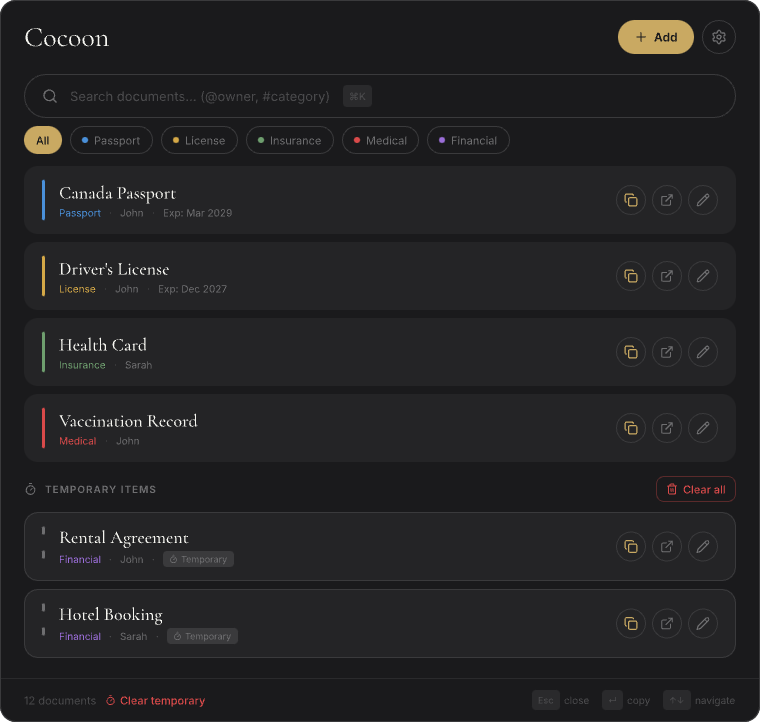
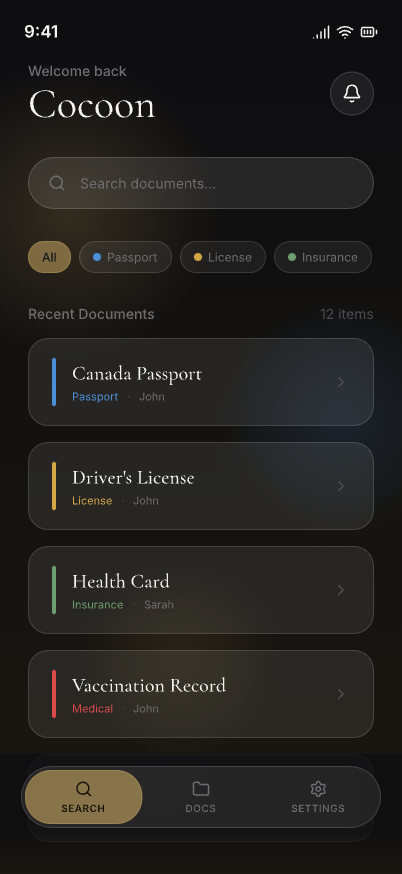

# Cocoon

> Your personal document vault — quick, secure retrieval of passport numbers, license details, insurance IDs, and more. Available as a macOS desktop overlay and an iOS mobile app.

[Landing Page](https://amol-patil.github.io/cocoon/)

<p align="center">
  
  &nbsp;&nbsp;&nbsp;
  
</p>

## Features

### Desktop (macOS overlay)
- Summon instantly with a global keyboard shortcut (`Control+Option+Space`)
- Fuzzy search across all documents, fields, owners, and categories
- One-click copy of any field value to clipboard (with auto-clear timer)
- Filter by category: Passport, License, Insurance, Medical, Financial
- Link entries to source files (scanned PDFs, images)
- Temporary items section for short-lived documents
- Dark-themed overlay that stays out of your way

### Mobile (iOS)
- Full document vault on your iPhone with Face ID / Touch ID protection
- Swipe-to-copy any field value
- Search with real-time highlighting
- Add, edit, and organize documents with categories and owners
- Encrypted export/import (`.cocoon` format, AES-256-GCM) to share between desktop and mobile
- Dark theme with glassmorphism UI

### Security
- Data encrypted at rest — desktop uses macOS Keychain via Electron `safeStorage`, mobile uses `expo-secure-store`
- Biometric authentication (Touch ID / Face ID) on both platforms
- Clipboard auto-clear after configurable timeout
- Encrypted `.cocoon` backup format (AES-256-GCM with PBKDF2 key derivation)
- No cloud sync, no external servers — everything stays on your devices

## Installation

### Desktop (macOS)

1. Download the `.dmg` from the [Latest Release](https://github.com/amol-patil/cocoon/releases/latest)
2. Mount and drag `Cocoon.app` to Applications
3. On first launch, right-click the app and choose "Open" to bypass Gatekeeper (the app is not yet signed with an Apple Developer certificate)

### Mobile (iOS)

The mobile app is not yet on the App Store. To run it locally:

```bash
cd cocoon-mobile
npm install
npx expo run:ios --device
```

Requires Xcode with a signing certificate configured (free Apple ID works).

## Development

### Desktop

```bash
cd app
npm install
npm run start        # development
npm run make         # build distributable
```

**Stack:** Electron 31, React 18, TypeScript, Tailwind CSS, Fuse.js, lowdb

### Mobile

```bash
cd cocoon-mobile
npm install
npx expo start       # Expo Go / dev client
npx expo run:ios     # native build
```

**Stack:** React Native (Expo), TypeScript, expo-secure-store, expo-router

### Project Structure

```
cocoon/
├── app/              # Desktop — Electron + React
├── cocoon-mobile/    # Mobile — React Native (Expo)
├── landing-page/     # Marketing site
└── docs/             # Documentation and screenshots
```

## License

MIT — see [LICENSE](LICENSE) for details.
